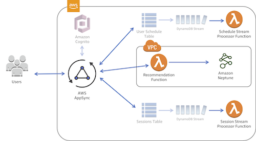

# AWS AppSync Session Manager - Phase II

aws-appsync-session-manager-neptune is a sample project that extends [previous work](https://github.com/jkahn117/aws-appsync-session-manager) with [AWS AppSync](https://aws.amazon.com/appsync/) to include an [Amazon Neptune](https://aws.amazon.com/neptune/)-powered recommendation engine for a simple scheduling app.

The goals of this phase of work are to:

1. Utilize a graph database in Amazon Neptune, a fully-managed graph database offered by AWS.
2. Build the Neptune database as well as supporting infrastructure via [AWS CloudFormation](https://aws.amazon.com/cloudformation/) and the [AWS Serverless Application Model](https://github.com/awslabs/serverless-application-model).
3. Integrate with earlier work by extending the AppSync-powered GraphQL API via [AWS Lambda](https://aws.amazon.com/lambda/).

A blog post on this project can be found at [TBD](https://medium.com/@joshua.a.kahn).

To get started, clone this repository:

``` bash
$ git clone https://github.com/jkahn117/aws-appsync-session-manager-neptune.git
```

### Prerequisites

This project requires the following to get started:

* Select an AWS Region into which you will deploy services. Be sure that all required services (AWS AppSync and Amazon Neptune, in particular) are available in the Region you select ([AWS Region Table](https://aws.amazon.com/about-aws/global-infrastructure/regional-product-services/)).
* [Install AWS SAM CLI](https://github.com/awslabs/aws-sam-cli/blob/develop/docs/installation.rst) and required dependencies (i.e. Docker, AWS CLI, Python).
* [Install jq](https://stedolan.github.io/jq/download/).

## Extending AWS AppSync Session Manager

If you have not already, [deploy Phase I of the AWS AppSync Session Manager](https://github.com/jkahn117/aws-appsync-session-manager/blob/master/README.md).

Once complete, we can extend the API to include a recommendation query. In addition, we will deploy an Amazon Neptune cluster and two Lambda functions to put data in Neptune as sessions and user schedules are modified. Below is a high-level overview of the architecture after Phase II (resources created in Phase I are shaded out):



Before we deploy new AWS resources, we first need to modify the existing Session Manager schema.

1. Open the AWS Console and navigate to AWS AppSync.

2. Open the previously created Session Manager API and click on Schema.

3. Within the Session Manager schema, modify the `Query` type as follows (note that we are adding a `recommendation` query):

    ``` graphql
    type Query {
        userSchedule: UserSchedule
        allSessions(nextToken: String): SessionConnection
        getSession(SessionId: ID!): Session
        search(text: String!): SessionConnection
        recommendations(userId: String): [Session]
    }
    ```

4. **Save** the schema by clicking the "Save Schema" button in the upper right corner.

5. Create a new S3 Bucket to house deplomyment assets:

    ``` bash
    $ aws s3 mb s3://MY_BUCKET_NAME
    ```

6. Next, we will use the SAM CLI to deploy our Amazon Neptune cluster, networking infrastructure, and Lambda functions. Note that deployment may 10-20 minutes.

    ``` bash
    $ sam package \
          --template-file template.yaml \
          --s3-bucket MY_BUCKET_NAME \
          --output-template-file packaged.yaml

    $ sam deploy \
          --template-file packaged.yaml \
          --capabilities CAPABILITY_NAMED_IAM \
          --stack-name aws-appsync-session-manager-neptune
    ```

**NEED TO ADD SESSION DATA TO NEPTUNE**

7. Once complete, we can create sample data by "registering" several users for sessions already in the session catalog (see blog post for further details):

    ``` bash
    $ node setup/setup.js
    ```

## Testing the Backend

With test data loaded to Neptune, we can now generate recommendations via a collaborative filtering approach. In short, this approach leverages the graph database to identify sessions that a user is not currently registered for but that attendees with similar existing registrations are.

1. In the AWS AppSync Console, select "Queries" in the left-hand menu.

2. Our API requires an authenticated user to access the API. Click on the "Login with User Pools" button:


Enter the following:

* ClientId - available as an output of Phase I
* Username - 'user'
* Password - 'NewPassword1%'

3. Register the user for a few sessions (a listing of all session can be found via the `allSessions` query -- see Phase 1 for details):

    ``` graphql
    mutation ScheduleSession {
        scheduleSession(SessionId: "SESSION_ID") {
            Sessions {
                Title
                StartTime
                EndTime
            }
        }
    }
    ```

4. Generate recommendations for the currently signed-in user:

    ``` graphql
    query Recommendations {
        recommendations {
            SessionId
            Title
            StartTime
            EndTime
        }
    }
    ```

5. Next, we can generate recommendations for another user by including that user's unique identifier as the `userId` parameter in our query:

    ``` graphql
    query RecommendationsOther {
    recommendations(userId: "28AA3C63-2454-4B3A-825B-983746CE935A") {
            SessionId
            Title
            StartTime
        }
    }
    ```

The result of the latter query should be similar to the following:

    ``` json
    {
        "data": {

        }
    }
    ```

## Cleaning Up

To clean-up all resources associated with this project (i.e. delete all resources), enter the following:

``` bash
$ aws cloudformation delete-stack \
	      --stack-name aws-appsync-session-manager-neptune
```

## Diving Deeper

As part of this project, I have included several additional resources that you may find useful in learning Amazon Neptune:

### AWS Cloud9

I found [AWS Cloud9](https://aws.amazon.com/cloud9/) incredibly useful in building and debugging the Lambda functions for this phase of work. Cloud9 is a powerful browser-based IDE, but more importantly for this work, can run in a VPC. By running my Cloud9 instance in a VPC, I was able to directly interface with my Neptune cluster and use the SAM CLI pre-installed on Cloud9 to debug locally.

To enable Cloud9, modify the included [template.yaml](./template.yaml) by un-commenting the DEV block towards the bottom of the file and deploy again. In the AWS Console, you can then access your Cloud9 instance, which should also have access to the Neptune cluster.

In Cloud9, I used the [Gremlin Console](http://tinkerpop.apache.org) to interace with Neptune. Details on connecting to your cluster from the Gremlin Console are available in [AWS documentation](https://docs.aws.amazon.com/neptune/latest/userguide/access-graph-gremlin-console.html).

### Load Data into Neptune

Amazon Neptune also provides the capability to [bulk load data](https://docs.aws.amazon.com/neptune/latest/userguide/bulk-load.html) from Amazon S3. Within the included [template.yaml](./template.yaml), un-comment the SAMPLE DATA section towards the bottom of the file to create an S3 Bucket and an IAM Role to load data in to Neptune from S3.

After creating the bucket, copy the files included in the `data` directory:

``` bash
$ aws s3 cp data s3://SAMPLE_DATA_BUCKET_NAME
```

Next, (add the IAM Role to your Neptune Cluster)[https://docs.aws.amazon.com/neptune/latest/userguide/bulk-load-tutorial-IAM.html#bulk-load-tutorial-IAM-add-role-cluster]. As of writing, this feature is not included in CloudFormation, but can be achieved via the AWS Conole of [AWS CLI](https://docs.aws.amazon.com/cli/latest/reference/neptune/add-role-to-db-cluster.html).

In Cloud9, you can then load the data via `curl` (note: role ARN is inclued in the Outputs of the CloudFormation template):

``` bash
$ curl -X POST \
        -H 'Content-Type: application/json' \
        http://your-neptune-endpoint:8182/loader -d '
        { 
            "source" : "s3://SAMPLE_DATA_BUCKET_NAME",
            "format" : "format",
            "iamRoleArn" : "arn:aws:iam::{YOUR_ACCOUNT_ID}:role/{YOUR_ROLE_NAME}",
            "region" : "YOUR_REGION",
            "failOnError" : "FALSE"
        }'
```

This project generally leverages DynamoDB Streams and Lambda functions to load data to Neptune, but bulk loading can be helpful in other scenarios.

## Authors

* **Josh Kahn** - *Initial work*